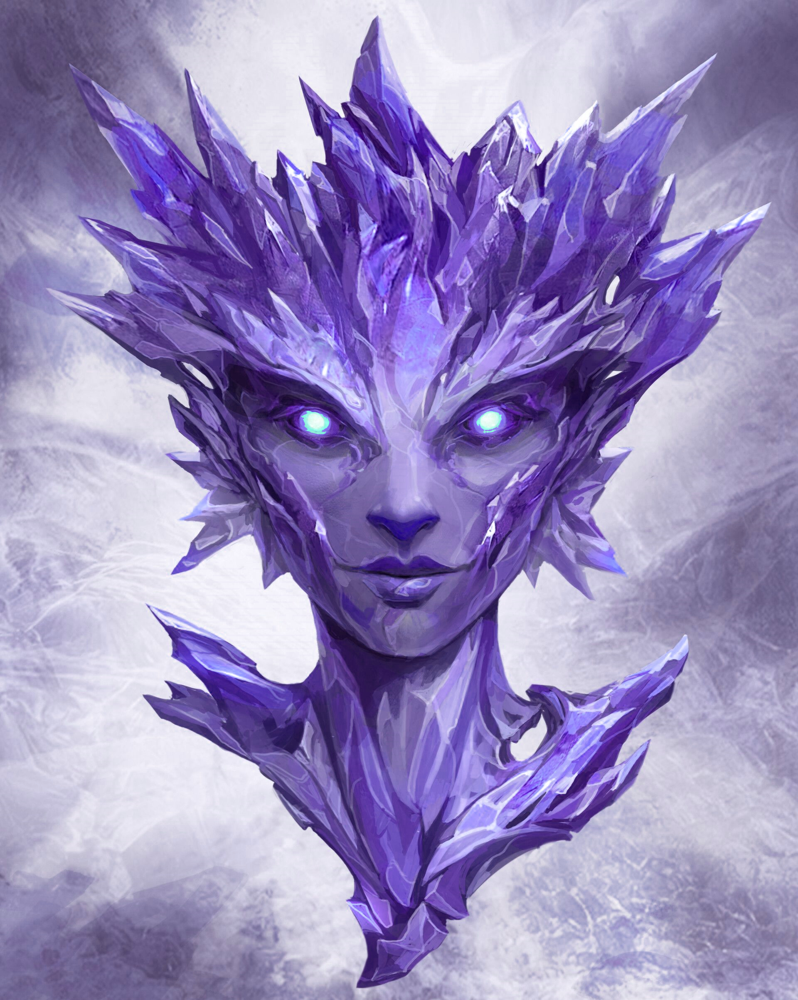

Fendoria (Fen)
Crystari (F) Priest of Larea
Passive Good, Moral/Order

Background Specials:
Remove Sing Racial Skill (did not practice this due to societal pressures)
Add Jewlery Knowledge Racial Skill (practiced this instead due to special interests)

Raised by adoptive elven parents, Fen thinks of herself as just another elf,
but faces ostracism from the jerks she calls her peers.  She wants to make real friends,
but the other kids were cruel growing up.  Her dark hues and lumpy appearance made them suspicious, and
they called her inner light ugly and oily.  She spent time alone in underground caves, accessible only by
underwater channels.  Not needing to breathe, and unable to swim, she simply hiked and climbed into these
spaces.  The rocks, gems, and minerals became her friends. She could tell them everything and they would
not judge.  For her favorites, she would make them elaborate settings and wear them so she would never
feel alone.  These pieces made for her friends were acts of love and through that love, an act of faith.
Fen isn't the most zealous Priest, but who she is and how she loves embodies everything Larea requires
in her faithful.  Her gemfriends all have names and personalities and Fen hopes that one day they will
also awaken as she has and have a voice.

Fen loves fiercely, bonds easily, and is loyal to a fault.  She's easily hurt by those she trusts, and
extremely resilient against taunts or denigration from those seen as "not in my geode". To those within
her circle, she is the picture of enthusiasm and a bubbly personality, wanting to learn everything about
them and share every. bit. of. her. story.  She craves connection and acceptance more than anything. When
meeting new people, Fen will start to mirror them in hopes of gaining accepetance--not knowing that she's
more than enough as-is. That realization will come with maturity, however, but for now, she is still naive
and immature.

According to her parents, Fen is too curious and excitable for her own good and is frequently getting in
trouble.  While she may appreciate order and crave structure, she absolutely cannot abide rules for things
that seem arbitrary, needless, or worse; harmful.  Rules she does understand and agree with, though, will
be followed to the letter, and she will insist that the others in her circle do the same.  She tries to
"be a good kid" to make her parents proud but her internal moral compass seems to point NW instead of N.
Reconciling her need for acceptance and desire to fit in with her own idea of right and wrong puts her at
odds with her community.

Mannerisms:

Fen does not need to blink.  Other eyeball having people find this extremely unnerving, so Fen tries to
mimic it with very poor success.  Often she'll forget to do it if she's very interested in someone, and
then try to make up for it with a bunch of blinking all at once.  It either causes the others to laugh
or wierds them out even more depending on the person.

Fen likes to go "swimming" and be in water despite sinking like a rock.  Fortunately, she doesn't need to
breathe, so its more like walking around in reduced gravity and that's a lot of fun.

Fen likes to mess with her "voice" and mimic sounds that aren't particularly organic.  When she sings, it
seems autotuned as she will instantly jump between frequencies with nothing to bridge them. Humming has a
similar issue in that it sounds like a piezoelectric buzz.  If she has any natural talent, it would require
a crystari vocal coach to bring it out.  She's done the best she can with her parents help, but can't quite
get there.  When Fen speaks, though, her accent and tone is indistinguishable from her elven peers--this
is due to long hours of vocal training with her Elven teachers during her time at school.

Physical Appearance:

Fen is a 5'4" asymmetrical, bulky crystari (fen cooked too long?) that has a translucent violet body with
lavender opal occlusions. This gives her skin an iridescent (oily) appearance.  Her eyes are cyan motes of
light. See attached file Screenshot_20231106-140245_Facebook.jpg for an example.

Nasty people would say "THIS is a crystari of legend? I expected beauty, grace, not a sad buzzing rock."
